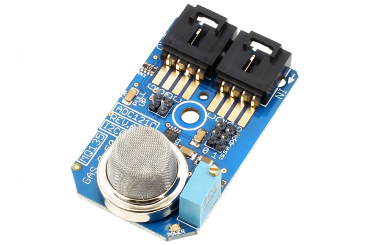

# ADC121C_MQ135

.

# ADC121C_MQ135
ADC121C_MQ135 is a NH3 Amonia Benzene Alcohol Gas Sensor.ADC121C 12-Bit ADC I²C Mini Module.
This Device is available from www.ncd.io 

[SKU: ADC121C_MQ135_I2CS]

(https://store.ncd.io/product/mq-135-nh3-amonia-benzene-alcohol-gas-sensor-adc121c-12-bit-adc-i%C2%B2c-mini-module/)
This Sample code can be used with Arduino.

Hardware needed to interface ADC121C_MQ135 sensor with Arduino

1. <a href="https://store.ncd.io/product/i2c-shield-for-arduino-nano/">Arduino Nano</a>

2. <a href="https://store.ncd.io/product/i2c-shield-for-arduino-micro-with-i2c-expansion-port/">Arduino Micro</a>

3. <a href="https://store.ncd.io/product/i2c-shield-for-arduino-uno/">Arduino uno</a>

4. <a href="https://store.ncd.io/product/dual-i2c-shield-for-arduino-due-with-modular-communications-interface/">Arduino Due</a>

5. <a href="https://store.ncd.io/product/mq-135-nh3-amonia-benzene-alcohol-gas-sensor-adc121c-12-bit-adc-i%C2%B2c-mini-module/">ADC121C_MQ135 NH3 Amonia Benzene Alcohol Gas Sensor</a>

6. <a href="https://store.ncd.io/product/i%C2%B2c-cable/">I2C Cable</a>

ADC121C_MQ135:

Sensitive material of MQ135 gas sensor is SnO2, which with lower conductivity in clean air. When the target combustible gas exist, The sensor’s conductivity is more higher along with the gas concentration rising.

Applications:

•Domestic air pollution detector

•Industrial air pollution detector

•Portable air pollution detector 

## Arduino
Download and install Arduino Software (IDE) on your machine. Steps to install Arduino are provided at:

https://www.arduino.cc/en/Main/Software

Download (or git pull) the code and double click the file to run the program.
Compile and upload the code on Arduino IDE and see the output on Serial Monitor.

How to Use the ADC121C_MQ135 Arduino Library
The ADC121C_MQ135 has a number of settings, which can be configured based on user requirements.

1.Automatic Conversion mode: When these bits are set to zeros, the automatic conversion mode is disabled. This is the case at power-up.When these bits are set to a non-zero value, the ADC will begin operating in automatic conversion mode.

    mq135.setCycleTime(CYCLE_TIME_32);              // Tconvert x 32, 27 ksps
    
2.Alert Hold:This bit tells the Alert will self clear or not.

   0: Alerts will self-clear when the measured voltage moves within the limits by more than the hysteresis register value.
  
   1: Alerts will not self-clear and are only cleared when a one is written to the alert high flag or the alert low flag in the Alert Status register.

    mq135.setAlertHold(ALERT_HOLD_CLEAR);         // Alerts will self-clear

3.Alert Flag Enable:This bit indicates when an alert condition has occurred. When the Alert Bit Enable is set in the Configuration Register, this bit will be high if either alert flag is set in the Alert Status Register.Otherwise, this bit is a zero.

   0: Disables alert status bit [D15] in the Conversion Result register.
  
   1: Enables alert status bit [D15] in the Conversion Result register.

       mq135.setAlertFlag(ALERT_FLAG_DISABLE);     // Disables alert status bit in the Conversion Result register
       
4.Alert Pin Enable:.

   0: Disables the ALERT output pin. The ALERT output will TRI-STATE when the pin is disabled.
  
   1: Enables the ALERT output pin
  
   mq135.setAlertPin(ALERT_PIN_DISABLE);       // Disables the ALERT output pin

5.Polarity: This bit configures the active level polarity of the ALERT output pin.

   0: Sets the ALERT pin to active low.
 
   1: Sets the ALERT pin to active high
 
    mq135.setPolarity(POLARITY_LOW);        // Sets the ALERT pin to active low
    
6.Voltage measurement:The following command is used to measure the concentration of amonia gas.

      mq135.Measure_Ammonia(-0.41, 1.0);      
